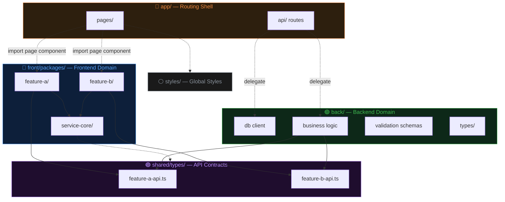
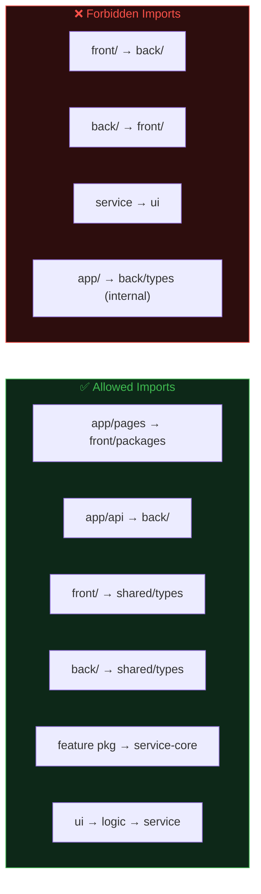

# Prism Architecture

> A prism separates white light into a clean spectrum.
> This architecture separates a monolith into **domain bands** with **layered internals**.

**Prism Architecture**는 단일 배포 가능한 풀스택 앱 내부를 `front / back / shared` 3개 도메인으로 분리하고, 프론트엔드 피처를 `ui → logic → service` 3레이어 패키지로 구성하는 아키텍처다.

---

## Core Principles

| # | 원칙 | 설명 |
|---|------|------|
| 1 | **Domain Triad** | `front/`, `back/`, `shared/` 3개 도메인. 상호 직접 import 금지 |
| 2 | **Shared Bridge** | 모든 cross-domain 타입은 `shared/types/`에만 존재. `front → shared ← back` |
| 3 | **Feature Package** | 각 피처는 독립 패키지 (`package.json` + barrel `index.ts`) |
| 4 | **Layer Direction** | 피처 내부 의존성: `ui → logic → service` (역방향 금지) |
| 5 | **Thin Routing Shell** | `app/`은 라우팅 + 레이아웃만. 비즈니스 로직 Zero |

---

## High-Level Dependency Flow



---

## Feature Package Internal Layers

```mermaid
graph TD
    subgraph PKG["Feature Package"]
        direction TB
        UI["ui/<br/>React components, pages, styles"]
        LOGIC["logic/<br/>hooks, state, business rules"]
        SERVICE["service/<br/>API calls via service-core"]
    end

    UI --> LOGIC
    LOGIC --> SERVICE

    UI -. "NEVER" .x SERVICE

    style UI fill:#0d1f3a,stroke:#58a6ff,color:#58a6ff
    style LOGIC fill:#1f0d2e,stroke:#bc8cff,color:#bc8cff
    style SERVICE fill:#0d2818,stroke:#3fb950,color:#3fb950
    style PKG fill:#161b22,stroke:#30363d,color:#e6edf3
```

### Layer Responsibilities

| Layer | 역할 | 포함 | 금지 |
|-------|------|------|------|
| **ui/** | 렌더링, 사용자 인터랙션 | React components, styles, event handlers | fetch, DB, 비즈니스 규칙 |
| **logic/** | 상태 관리, 비즈니스 규칙 | hooks, validators, transformers | React JSX, fetch |
| **service/** | 외부 통신 | API call functions (via service-core) | React, DOM, 상태 |

---

## Directory Template

```
src/
├── app/                          # Routing Shell (framework-specific)
│   ├── layout.tsx
│   ├── page.tsx
│   ├── {feature-a}/page.tsx      # thin → imports FeatureAPage
│   ├── {feature-b}/page.tsx      # thin → imports FeatureBPage
│   └── api/
│       ├── {feature-a}/route.ts  # delegates to back/
│       └── {feature-b}/route.ts
│
├── front/                        # Frontend Domain
│   └── packages/
│       ├── {feature-a}/          # Feature Package
│       │   ├── package.json      # @{project}/{feature-a}
│       │   ├── index.ts          # barrel export
│       │   └── src/
│       │       ├── types.ts
│       │       ├── ui/
│       │       │   ├── FeatureAPage.tsx
│       │       │   ├── FeatureAPage.module.scss
│       │       │   └── index.ts
│       │       ├── logic/
│       │       │   └── index.ts
│       │       └── service/
│       │           ├── featureAApi.ts
│       │           └── index.ts
│       │
│       └── service-core/         # Shared HTTP Client
│           ├── package.json
│           ├── index.ts
│           └── src/
│               ├── apiClient.ts
│               ├── types.ts      # ApiError, ApiResult<T>
│               └── errorMapper.ts
│
├── back/                         # Backend Domain
│   ├── db.ts                     # DB client
│   ├── schemas.ts                # Request validation (Zod)
│   └── types/
│       ├── index.ts
│       └── {domain}.ts           # Backend-only types
│
├── shared/                       # Cross-domain Contracts
│   └── types/
│       ├── index.ts
│       ├── {feature-a}-api.ts    # Request/Response types
│       └── {feature-b}-api.ts
│
└── styles/                       # App-level Styles Only
    └── globals.scss
```

---

## Import Rules



### Path Alias Convention

| Alias Pattern | Maps To | Domain |
|---------------|---------|--------|
| `@{feature}` | `src/front/packages/{feature}` | Frontend |
| `@{feature}/*` | `src/front/packages/{feature}/*` | Frontend |
| `@service-core` | `src/front/packages/service-core` | Frontend |
| `@back/*` | `src/back/*` | Backend |
| `@shared/*` | `src/shared/*` | Shared |

---

## Package.json Template

```json
{
  "name": "@{project}/{feature}",
  "private": true,
  "exports": {
    ".": "./index.ts",
    "./service": "./src/service/index.ts",
    "./types": "./src/types.ts"
  }
}
```

---

## When to Use Prism Architecture

| ✅ Good Fit | ❌ Overkill |
|-------------|------------|
| 풀스택 Next.js / Nuxt / SvelteKit 앱 | 순수 SPA (API 없음) |
| 2개 이상의 독립 피처 존재 | 단일 CRUD 페이지 |
| front/back 경계가 명확한 프로젝트 | 프로토타입 / 해커톤 |
| 팀 규모 2인 이상 또는 장기 유지보수 | 1회성 스크립트 |

---

## Checklist: New Project Setup

- [ ] `tsconfig.json`에 path alias 추가
- [ ] `src/front/packages/service-core/` 생성 (apiClient, types, errorMapper)
- [ ] `src/shared/types/` 생성 (API contract types)
- [ ] `src/back/` 생성 (DB client, schemas, backend types)
- [ ] 첫 번째 feature package 생성 (`package.json` + `index.ts` + `src/ui,logic,service/`)
- [ ] `app/` page를 thin wrapper로 작성
- [ ] `tsc --noEmit` 통과 확인
