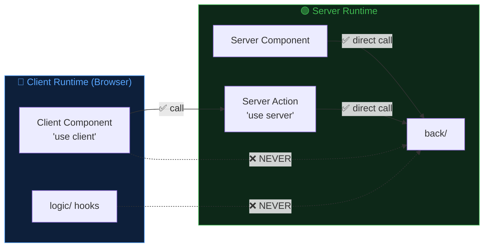
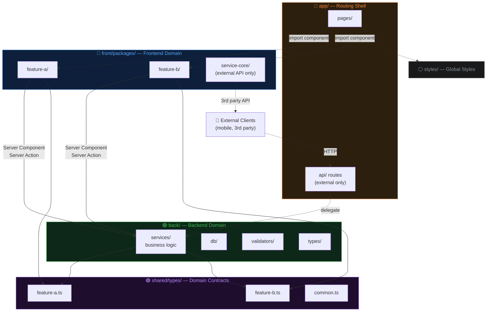
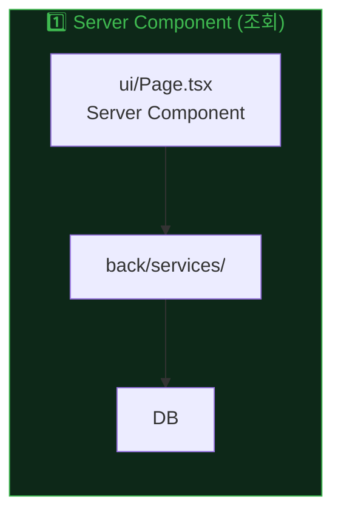
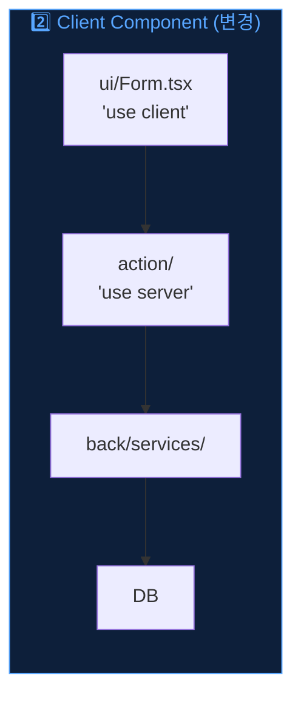
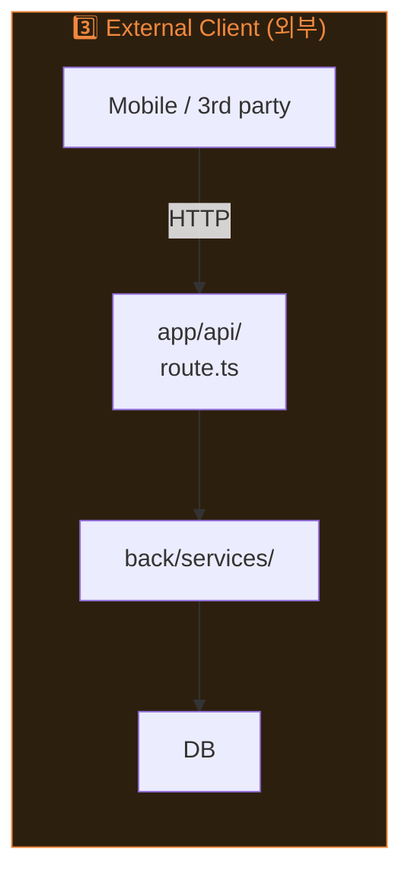
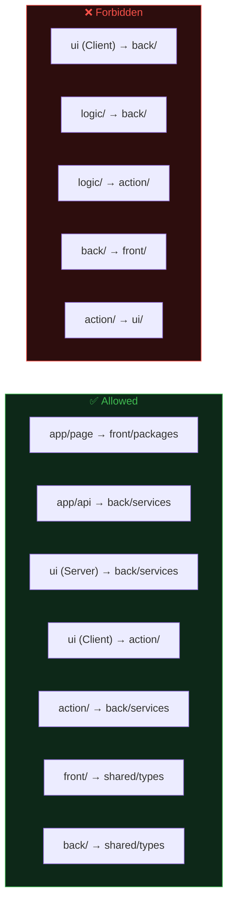

# Prism Architecture

> A prism separates white light into a clean spectrum.
> This architecture separates a monolith into **domain bands** with **layered internals**.

**Prism Architecture**는 단일 배포 가능한 풀스택 앱 내부를 `front / back / shared` 3개 도메인으로 분리하고, 프론트엔드 피처를 `ui → logic → action` 3레이어 패키지로 구성하는 아키텍처다.

> **Next.js Adaptation**: 이 문서는 Next.js App Router 기반 풀스택 앱에 최적화된 버전이다.
> 런타임 기준(서버/클라이언트)으로 도메인 경계를 정의하며,
> Server Components와 Server Actions를 활용한 데이터 흐름을 제공한다.

---

## Core Principles

| # | 원칙 | 설명 |
|---|------|------|
| 1 | **Domain Triad** | `front/`, `back/`, `shared/` 3개 도메인 |
| 2 | **Runtime Boundary** | 클라이언트 코드 → `back/` 직접 import 금지. 서버 코드 → `back/` 허용 |
| 3 | **Shared Bridge** | 양쪽 공유 타입은 `shared/types/`에만 존재. `front → shared ← back` |
| 4 | **Feature Package** | 각 피처는 독립 패키지 (`package.json` + barrel `index.ts`) |
| 5 | **Layer Direction** | 피처 내부 의존성: `ui → logic → action` (역방향 금지) |
| 6 | **Thin Routing Shell** | `app/`은 라우팅 + 레이아웃만. 비즈니스 로직 Zero |

---

## Runtime Boundary

Prism의 도메인 경계는 디렉토리가 아닌 **런타임 환경**을 기준으로 한다.



| 코드 | 실행 환경 | `back/` 직접 호출 |
|------|----------|------------------|
| Server Component | 서버 | ✅ 허용 |
| Server Action (`'use server'`) | 서버 | ✅ 허용 |
| Client Component (`'use client'`) | 브라우저 | ❌ 금지 |
| logic/ (hooks, utils) | 브라우저 | ❌ 금지 |

---

## High-Level Dependency Flow



---

## Data Flow Patterns

3가지 데이터 흐름 경로가 존재한다. `back/services/`가 단일 진입점이다.







| 패턴 | 호출자 | 경로 | 통신 |
|------|--------|------|------|
| **1. Server Component** | 서버 렌더링 페이지 | `ui/ → back/services/` | 함수 호출 (같은 프로세스) |
| **2. Client Component** | 브라우저 인터랙션 | `ui/ → action/ → back/services/` | Server Action (Next.js 자동 처리) |
| **3. External Client** | 모바일, 3rd party | `HTTP → app/api/ → back/services/` | HTTP API |

---

## Feature Package Internal Layers

```mermaid
graph TD
    subgraph PKG["Feature Package"]
        direction TB
        UI["ui/<br/>Server & Client Components"]
        LOGIC["logic/<br/>client hooks, validators, transformers"]
        ACTION["action/<br/>'use server' functions → back/"]
    end

    UI --> LOGIC
    UI --> ACTION
    LOGIC -. "NEVER" .x ACTION

    style UI fill:#0d1f3a,stroke:#58a6ff,color:#58a6ff
    style LOGIC fill:#1f0d2e,stroke:#bc8cff,color:#bc8cff
    style ACTION fill:#0d2818,stroke:#3fb950,color:#3fb950
    style PKG fill:#161b22,stroke:#30363d,color:#e6edf3
```

### Layer Responsibilities

| Layer | 역할 | 포함 | 금지 |
|-------|------|------|------|
| **ui/** | 렌더링, 사용자 인터랙션 | Server/Client Components, styles, event handlers | 비즈니스 규칙, DB 직접 접근 |
| **logic/** | 클라이언트 상태·로직 | hooks, validators, transformers | `back/` import, Server Action 정의 |
| **action/** | 서버 사이드 진입점 | `'use server'` 함수 → `back/services/` 호출 | React, DOM, 상태 관리 |

> **ui/ → action/ 직접 호출 허용**: Client Component가 Server Action을 호출하는 것은 Next.js의 핵심 패턴이다.
> **logic/ → action/ 금지**: hooks에서 Server Action을 직접 import하면 서버/클라이언트 경계가 모호해진다. Client Component에서 action을 호출하고 결과를 hook에 전달하라.

---

## Directory Template

```
src/
├── app/                              # Routing Shell (thin)
│   ├── layout.tsx
│   ├── page.tsx
│   ├── {feature-a}/
│   │   └── page.tsx                  # thin → imports FeatureAPage
│   ├── {feature-b}/
│   │   └── page.tsx                  # thin → imports FeatureBPage
│   └── api/                          # External clients only
│       └── {feature-a}/route.ts      # only when external API needed
│
├── front/                            # Frontend Domain
│   └── packages/
│       ├── {feature-a}/              # Feature Package
│       │   ├── package.json          # @{project}/{feature-a}
│       │   ├── index.ts              # barrel export
│       │   └── src/
│       │       ├── types.ts          # feature-local types
│       │       ├── ui/
│       │       │   ├── FeatureAPage.tsx        # Server Component
│       │       │   ├── FeatureAForm.tsx        # 'use client'
│       │       │   ├── FeatureAForm.module.scss
│       │       │   └── index.ts
│       │       ├── logic/
│       │       │   ├── useFeatureA.ts          # client hook
│       │       │   ├── validators.ts
│       │       │   └── index.ts
│       │       └── action/                     # Server Actions
│       │           ├── featureA.action.ts      # 'use server'
│       │           └── index.ts
│       │
│       └── service-core/             # External API Client (optional)
│           ├── package.json          # @{project}/service-core
│           ├── index.ts
│           └── src/
│               ├── apiClient.ts      # for 3rd party APIs only
│               ├── types.ts          # ApiError, ApiResult<T>
│               └── errorMapper.ts
│
├── back/                             # Backend Domain
│   ├── db/
│   │   └── client.ts                 # Prisma / Drizzle client
│   ├── services/                     # Business Logic (single entry point)
│   │   ├── featureA.service.ts
│   │   └── featureB.service.ts
│   ├── validators/                   # Request validation (Zod)
│   │   ├── featureA.validator.ts
│   │   └── featureB.validator.ts
│   └── types/                        # Backend-only types
│       └── index.ts
│
├── shared/                           # Cross-domain Contracts
│   └── types/
│       ├── index.ts
│       ├── {feature-a}.ts            # shared domain types
│       ├── {feature-b}.ts
│       └── common.ts                 # shared enums, constants
│
└── styles/                           # App-level Styles Only
    └── globals.css
```

---

## Import Rules



### Import Rule Matrix

| From ↓ \ To → | `back/` | `shared/` | `front/` | `action/` | `logic/` | `ui/` |
|---------------|---------|-----------|----------|-----------|----------|-------|
| **app/page** | — | — | ✅ | — | — | — |
| **app/api** | ✅ | ✅ | ❌ | — | — | — |
| **ui/** (Server) | ✅ | ✅ | — | ✅ | ✅ | — |
| **ui/** (Client) | ❌ | ✅ | — | ✅ | ✅ | — |
| **logic/** | ❌ | ✅ | — | ❌ | — | — |
| **action/** | ✅ | ✅ | — | — | ❌ | ❌ |
| **back/** | — | ✅ | ❌ | — | — | — |

### Path Alias Convention

| Alias | Maps To | Domain |
|-------|---------|--------|
| `@{feature}` | `src/front/packages/{feature}` | Frontend |
| `@{feature}/*` | `src/front/packages/{feature}/*` | Frontend |
| `@service-core` | `src/front/packages/service-core` | Frontend |
| `@back/*` | `src/back/*` | Backend |
| `@shared/*` | `src/shared/*` | Shared |

---

## Package.json Template

```json
{
  "name": "@{project}/{feature}",
  "private": true,
  "exports": {
    ".": "./index.ts",
    "./action": "./src/action/index.ts",
    "./types": "./src/types.ts"
  }
}
```

---

## When `app/api/` Is Needed

`app/api/` 라우트는 **외부 클라이언트가 있을 때만** 생성한다.

| 필요 | 불필요 |
|------|--------|
| 모바일 앱이 같은 백엔드를 쓸 때 | 웹 전용 앱 |
| 외부 서비스에 webhook 제공할 때 | 내부 데이터 CRUD |
| 3rd party 연동 (OAuth callback 등) | Server Action으로 충분할 때 |
| 공개 API 제공 | 서버 → 서버 내부 호출 |

---

## When `service-core/` Is Needed

`service-core/`는 **외부 API 호출이 있을 때만** 사용한다.

| 필요 | 불필요 |
|------|--------|
| 결제 API (Stripe, Toss 등) | 내부 DB CRUD |
| OAuth provider 연동 | Server Action → back/ 호출 |
| 3rd party REST/GraphQL API | 자체 back/services/ 호출 |

외부 연동이 없으면 `service-core/` 자체를 생략한다.

---

## When to Use Prism Architecture

| ✅ Good Fit | ❌ Overkill |
|-------------|------------|
| 풀스택 Next.js App Router 앱 | 순수 SPA (API 없음) |
| 2개 이상의 독립 피처 존재 | 단일 CRUD 페이지 |
| front/back 경계가 명확한 프로젝트 | 프로토타입 / 해커톤 |
| 팀 규모 2인 이상 또는 장기 유지보수 | 1회성 스크립트 |
| Server Component 활용 극대화 | Pages Router 레거시 |

---

## Checklist: New Project Setup

- [ ] `tsconfig.json`에 path alias 추가 (`@back/*`, `@shared/*`, `@{feature}/*`)
- [ ] `src/shared/types/` 생성 (공유 도메인 타입)
- [ ] `src/back/` 생성 (db client, services, validators)
- [ ] 첫 번째 feature package 생성 (`package.json` + `index.ts` + `src/ui,logic,action/`)
- [ ] `app/` page를 thin wrapper로 작성
- [ ] Server Component에서 `back/services/` 직접 호출 확인
- [ ] Client Component에서 Server Action 호출 확인
- [ ] `tsc --noEmit` 통과 확인
- [ ] (선택) 외부 클라이언트 필요 시 `app/api/` 라우트 추가
- [ ] (선택) 외부 API 연동 시 `service-core/` 생성
